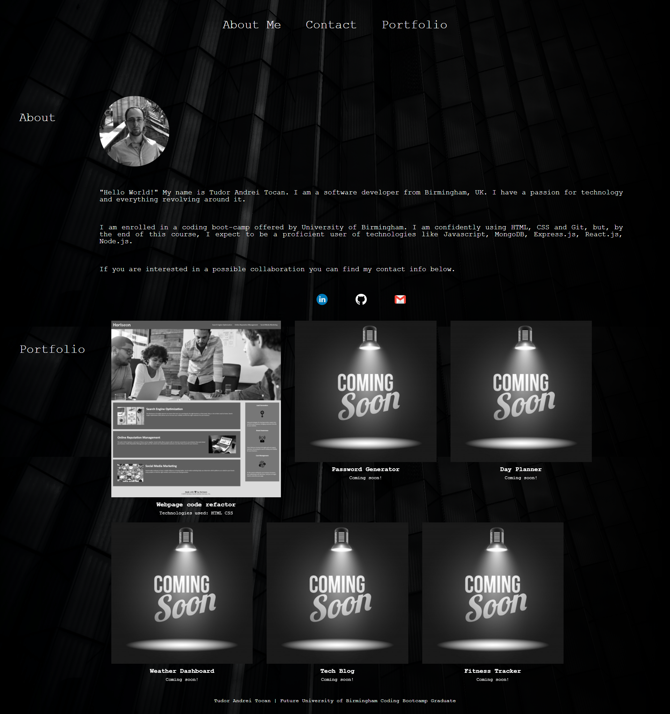

# Title

Personal Portfolio

## Description

As a developer I have built my Portfolio landing page.

- The page contains a navigation bar with clickable links towards certain sections of the page.
- The About Me sections contains a profile picture and a short description.
- The profile photo changes shape and color when hovered on with the mouse.
- After the About Me section there is a Contact section. The logos are linked to their respective websites or contact info.
- Portfolio section contains images and description of completed projects.
- Every image rescales, changes colour and gets a border when hovered on with the mouse.
- Every image is clickable and linked to that respective project.
- The landing page is responsive and adapts and reorders its content based on the size of the viewport.

## Screenshots

You can view Screenshot of the deployed application

## Link to Github

You can access Github repository [here](https://github.com/ttudorandrei/personal_portfolio)

## Link to deployed application

You can access the Deployed application [here](https://ttudorandrei.github.io/personal_portfolio/)
